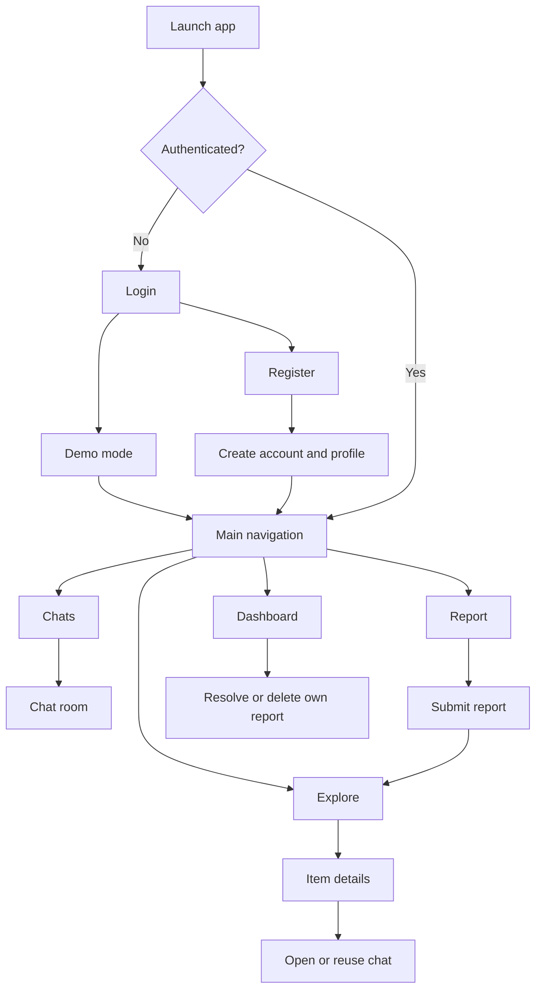
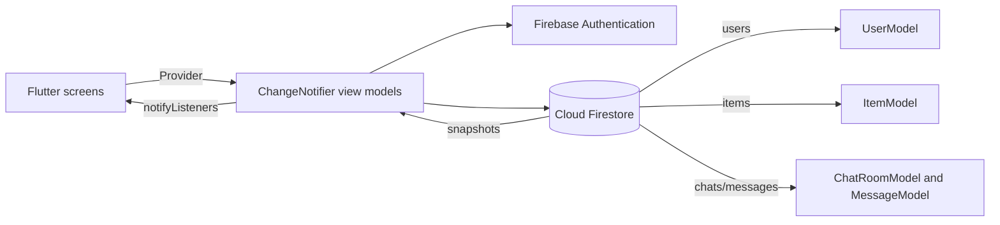

# CampusFound Project Report

## 1. Project Overview

CampusFound is a Flutter mobile application for reporting, discovering, and resolving lost and found items within a university community. The app separates data by university, allows students to publish lost or found reports, and provides direct chat between people connected to an item.

### Problem

University lost-and-found communication is often fragmented across informal group chats and notice boards. CampusFound gives students one searchable place to report an item, browse unresolved reports, contact another student, and mark a report as resolved.

### Target users

- Students who lost an item.
- Students who found an item.
- Students who need to contact the owner or finder.

### Technology stack

- Flutter and Dart
- Provider with `ChangeNotifier` view models
- Firebase Authentication for account access
- Cloud Firestore for users, items, chats, and messages
- `flutter_map` and `latlong2` for campus locations
- Image picker and Cloudinary-related packages for item media support

## 2. Implemented Features

### Authentication and onboarding

- Email/password registration and login through Firebase Authentication.
- User profile storage in the Firestore `users` collection.
- University selection during registration and profile-level university changes.
- Demo mode for exploring the app without entering credentials.
- Sign out and authentication-state routing.

### Explore

- University-scoped real-time item feed.
- Unresolved reports shown by default.
- Search across item title, location, and description.
- Lost, Found, and All Items type filters.
- Category filtering for electronics, books, accessories, ID cards, and other items.
- Item details, location information, and contact action.

### Reporting and CRUD

- Create a lost or found report with title, description, category, location, date, and optional coordinates/image.
- Read reports from Firestore in real time.
- Mark an owned report resolved or active.
- Delete an owned report.
- Firestore rules and view-model checks restrict update/delete actions to the original reporter.

### Dashboard

- Personal profile and university.
- Total report count.
- Active lost count.
- Active found count.
- Resolved report count.
- Personal report list with status actions.

### Chat

- Create or reuse a chat room for a specific item and pair of users.
- List rooms for the current user.
- Real-time message listener.
- Chronological message display.
- Last-message preview and timestamp on the parent chat room.

### Location support

- Optional latitude and longitude on item reports.
- Campus regions, centers, landmarks, containment checks, and coordinate clamping are covered by tests.

## 3. Screen Flow



## 4. Data Flow and Architecture

The application uses a small MVVM-style structure. Screens read state from Provider view models. View models validate user actions, call Firebase services, map Firestore documents into models, and notify screens when state changes.



### Main collections

| Collection | Purpose | Important fields |
|---|---|---|
| `users` | Student profile | `uid`, `name`, `email`, `university` |
| `items` | Lost/found reports | `title`, `description`, `category`, `location`, `isLost`, `isResolved`, `reportedBy`, `university` |
| `chats` | Conversations linked to reports | `itemId`, `participants`, `participantNames`, `lastMessage` |
| `chats/{chatId}/messages` | Individual messages | `senderId`, `senderName`, `text`, `timestamp` |

## 5. State Management

### `AuthViewModel`

Owns authentication state, loading state, errors, profile loading, registration, login, demo mode, university updates, and sign out. The root widget switches between `LoginScreen` and `MainNavigationScreen` based on `isAuthenticated`.

### `LostFoundViewModel`

Owns the university-filtered Firestore item subscription, search query, type/category filters, report creation, dashboard statistics, resolve status, deletion, and error/loading state. `exploreItems` is derived from the complete subscribed list.

### `ChatViewModel`

Owns the current user's chat-room subscription, active message subscription, room creation/reuse, message sending, and cleanup of subscriptions.

## 6. CRUD, Search, and Filter Behavior

| Operation | Behavior |
|---|---|
| Create | A new `ItemModel` is written to `items` with the reporter and university attached. |
| Read | Firestore snapshots update the local item list in real time. Reports are sorted newest first. |
| Update | The reporter can toggle `isResolved`; the same ownership rule is enforced in the view model and Firestore rules. |
| Delete | The reporter can delete the report after confirmation. |
| Search | Case-insensitive query matches title, location, or description. |
| Type filter | Shows all reports, lost reports only, or found reports only. |
| Category filter | Restricts results to the selected category. |
| Default feed | Resolved reports are excluded from Explore. Personal dashboard reports include active and resolved records. |

## 7. Security and Validation

- Authenticated users can read profiles and items.
- A user can write their own profile document.
- Item updates and deletes require the authenticated user's UID to match `reportedBy`.
- Chat-room reads and updates require participation in the room.
- The app also performs ownership checks before update and delete calls.
- Empty chat messages are rejected before a write.
- Form validation is present on login and registration flows.

The current Firestore message rule permits any authenticated user to read or write messages in a chat document. This is a known limitation and should be tightened to verify that the user belongs to the parent chat's `participants` list before production deployment.

## 8. Testing Evidence

The repository includes automated Flutter tests in `test/unit_test.dart` and `test/widget_test.dart`.

### Covered test areas

- Required item categories and maximum image-size constant.
- Campus centers, boundaries, landmarks, and coordinate clamping.
- `ItemModel` serialization, deserialization, coordinates, and `copyWith`.
- `UserModel` serialization and deserialization.
- Chat participant-name resolution.
- Message serialization.
- Date formatting.
- Basic item-card rendering in a Flutter widget test.

### Reproducible command

```text
flutter test
```

Verified in this repository on September 19, 2026: `12` tests passed. Capture a terminal screenshot of the result for the final evidence set. The existing tests are model, utility, and widget tests; an additional integration test against Firebase would strengthen evidence for authentication, Firestore CRUD, and real-time chat.

## 9. Screenshot Evidence Plan

Capture the screens listed in `docs/SCREENSHOT_CHECKLIST.md`. Each screenshot should show the app title or visible feature context and should be taken from the running application, not from source code.

Recommended evidence set:

1. Login and demo mode.
2. Explore feed with search and filters.
3. Report form.
4. Item details with location/contact action.
5. Dashboard with counts and report actions.
6. Chat list and an open conversation.
7. Successful test run.

## 10. Limitations and Future Work

- Firebase-dependent flows need configured Firebase services and network access for full end-to-end testing.
- The default demo account is intended for exploration and is not a production authentication mechanism.
- Chat message rules should validate parent-room membership.
- There is no automated integration test for the full Firebase workflow.
- Image hosting and image upload behavior should be verified on a real device and documented with a screenshot.
- Report editing currently focuses on resolving/activating and deleting; full field editing could be added later.
- A moderation or abuse-reporting workflow is not currently represented in the app.
- Accessibility review, localization, and offline conflict handling should be expanded before production release.

## 11. Observation and Conclusion

CampusFound provides a coherent campus lost-and-found workflow: authenticate or enter demo mode, select a university, browse unresolved reports, search and filter the feed, submit a report, communicate with another participant, and resolve or remove owned reports. The Provider view-model structure keeps screen code focused on presentation while Firebase supplies persistent and real-time data.

The strongest demonstrated areas are the report model, university scoping, search/filter behavior, ownership checks, campus coordinate utilities, and chat data flow. The next validation step is a real-device walkthrough with Firebase enabled, accompanied by the screenshot set and a recorded `flutter test` result.

## 12. Contribution Summary

Replace the placeholders below with the actual team-member names and verified work before submission.

| Team member | Contribution |
|---|---|
| Member 1: `[name]` | `[authentication, profile, or onboarding work]` |
| Member 2: `[name]` | `[lost/found reports, CRUD, search, or filters]` |
| Member 3: `[name]` | `[chat, location, testing, or Firebase work]` |
| Member 4: `[name]` | `[UI design, documentation, testing, or deployment work]` |

## 13. Source Map

- Application entry and providers: `lib/main.dart`
- Navigation: `lib/features/home/views/main_navigation_screen.dart`
- Authentication: `lib/features/auth/`
- Lost/found model and logic: `lib/features/lost_found/`
- Chat model and logic: `lib/features/chat/`
- Firestore authorization: `firestore.rules`
- Automated tests: `test/`